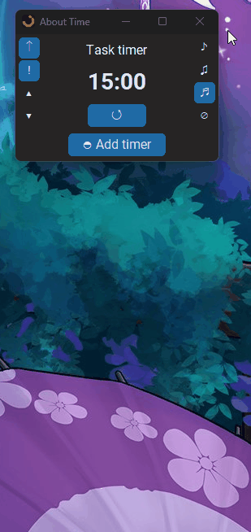

# About Time - Always-on-Top Timer App

> **This project is in active development.** Features and behaviour may change between releases.

**A free Windows desktop timer that stays on top of everything else.**

About Time keeps your countdowns always visible, no matter what you're working on. Run up to 5 named task timers simultaneously, each with its own label and countdown, and choose from an optional family of notification sounds when each one finishes. Perfect for productivity workflows where you need a floating timer that doesn't disappear behind your browser or IDE.

This project was made to account for a personal need for an always-on-top timer program, and is an ongoing project built in tandem with Claude Code as a practical exercise in working with AI-assisted development tools.

## Download

Grab the latest `.exe` from [Releases](https://github.com/Fjarun/About-Time/releases) — no install required, runs directly on Windows.

No Python or code needed.

## Features

- **Always-on-top toggle** — pin the window so it floats above everything else on screen
- Run up to **5 simultaneous countdown timers** at once, each independently named and tracked
- Add timers one at a time via the **Add timer** button; remove any individual slot with its **x** button — no need to manage a fixed set
- Custom time input per timer (maximum 99:59:59), with flexible input: plain numbers assumed as minutes, or suffix with `s`, `m`, or `h`
- Click the countdown display to edit the time at any point — even mid-run
- **Windows desktop notifications** — opt-in toast alerts when any timer finishes, showing the timer's name or duration if untitled

### Sounds

- Three notification chimes — short, medium, and long — designed as a matched family with consistent tone and feel
- **Mute option** — silence all timer alerts for distraction-free or shared-space use
- **Volume control** — adjust in 5% increments directly from the main window
- Sound selector always visible with instant preview on click, so you always know what you're setting

### Persistence

- Window position, timer count, timer names and durations are all remembered between sessions
- Mid-run and paused timers restore at their remaining time on reopen — ready to resume or reset, no progress lost on accidental close
- Sound choice, volume, always-on-top state, and notification preference saved automatically

## Tech Stack

| | |
|---|---|
| Language | Python 3.x |
| UI | customtkinter |
| Audio | winsound + struct (WAV synthesised in-memory — no audio files) |
| Notifications | winotify (Windows toast) |
| Build | PyInstaller |
