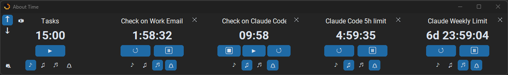
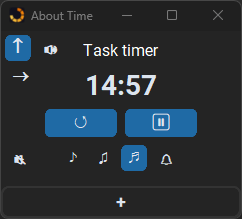
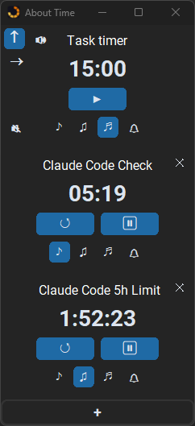

# About Time - Always-on-Top Timer App

  

> **This project is in active development.** Features and behaviour may change between releases.
>
> MIT licensed — free to use, copy, modify, and redistribute, including commercially, as long as the license text stays attached.

**A free Windows desktop timer that stays on top of everything else.**

About Time keeps your countdowns always visible, no matter what you're working on. Run up to 5 named task timers simultaneously, each with its own label and countdown, and choose from an optional family of notification sounds when each one finishes. Perfect for productivity workflows where you need a floating timer that doesn't disappear behind your browser or IDE.

1. [Why This Exists](#why-this-exists)
1. [Download](#download)
1. [Features](#features)
1. [Known Issues / Notes](#known-issues--notes)
1. [Tech Stack](#tech-stack)

## Why This Exists

Every always-on-top timer solution I found was either bundled into something heavier than I wanted (a full productivity suite, a Pomodoro app with its own opinionated workflow) or was a single fixed timer with no room for running several named countdowns side by side. I wanted something narrower: a small floating window, several independent timers I could label myself, sane persistence so a timer I'm mid-way through survives a restart, and nothing else competing for attention.

About Time is that — built to fit a personal need first, and shared because a small focused tool that does one thing well tends to be useful to more people than just the one who built it. It's also an ongoing practical exercise in working with Claude Code as an AI-assisted development tool, developed in the open as both a working app and a real example of that workflow.

## Download

Grab the latest `.exe` from [Releases](https://github.com/Fjarun/About-Time/releases) — no install required, runs directly on Windows.

No Python or code needed.

## Features

- **Always-on-top toggle** — pin the window so it floats above everything else on screen
- Run up to **5 simultaneous countdown timers** at once, each independently named and tracked
- Custom time input per timer, up to 30 days: plain numbers assumed as minutes, suffix with `s`/`m`/`h`/`d` for a single unit, mix units in one go — `3h14m`, `1d2h15m` — or type a clock format directly (`90:00`, `1:30:00`, `2d 3:45:12`). Past 24 hours the countdown displays as `Nd H:MM:SS`
- Click the countdown display to edit the time at any point — even mid-run
- **Windows desktop notifications** — opt-in toast alerts when a timer finishes, toggled per timer, showing that timer's name or duration if untitled

### Sounds

- Three notification chimes — short, medium, and long — designed as a matched family with consistent tone and feel
- Each timer has its own sound picker — pick short, medium, or long, or click the active one again to turn that timer's sound off
- **Mute** — silences every timer at once without touching any timer's own sound choice; per-timer sound pickers are locked while muted
- **Windows Volume Mixer integration** — the speaker icon opens a slider that controls this app's own volume directly in Windows' native per-app mixer (click outside the slider to close it)

 

### Layouts

- **Layout toggle** — switch between a vertical stack and a horizontal row of timers; boxes stay a fixed size in either layout
- Add timers one at a time via the **+** tile at the end of the stack/row; remove any individual slot with its **x** button — no need to manage a fixed set
- The window isn't manually resizable by design — it automatically sizes itself to exactly fit however many timers you currently have, in whichever layout you're in, so there's never dead space or a cropped timer to fight with
- Every timer box holds its size regardless of state — idle, running, paused, or just finished — so the window never jumps around as a countdown changes

 

### Persistence

- Window position, timer count, timer names and durations are all remembered between sessions
- Mid-run and paused timers restore at their remaining time on reopen — ready to resume or reset, no progress lost on accidental close
- Sound choice and notification preference are saved per timer automatically; always-on-top and layout mode are saved globally

## Known Issues / Notes

- **First launch starts at 50% volume, not your system default.** This is intentional, not a bug: a brand-new Windows audio session for an app defaults to 100%, and About Time's own volume lives entirely in Windows' per-app Volume Mixer (see Sounds above). Rather than risk a first-ever countdown finishing at full blast on whatever your system volume happens to be, first launch caps that fresh session to 50% — adjust it anytime with the speaker icon, it's a one-time starting point, not a ceiling.

## Tech Stack

| | |
|---|---|
| Language | Python 3.x |
| UI | customtkinter |
| Audio | winsound + struct (WAV synthesised in-memory — no audio files); pycaw for Windows Volume Mixer integration |
| Notifications | winotify (Windows toast) |
| Build | PyInstaller |
