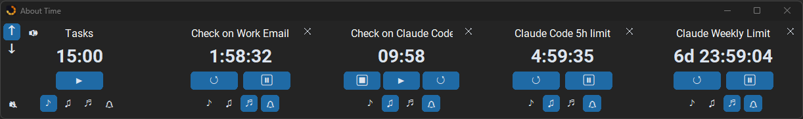
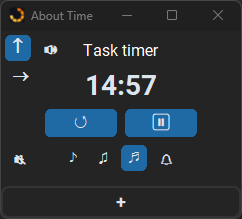
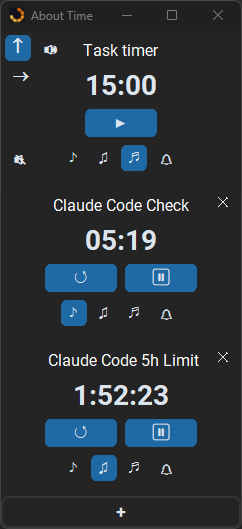

# About Time - Always-on-Top Timer App

  

> **This project is in active development.** Features and behaviour may change between releases.
>
> MIT licensed — free to use, copy, modify, and redistribute, including commercially, as long as the license text stays attached.

**A free Windows desktop timer that stays on top of everything else.**

About Time keeps your countdowns always visible, no matter what you're working on. Run up to 5 named task timers simultaneously, each with its own label and countdown, and choose from an optional set of notification sounds when each one finishes. Designed for people who are constantly needing to switch tabs (and monitors) without losing track of time left on something else.

1. [Why This Exists](#why-this-exists)
1. [Download](#download)
1. [Features](#features)
1. [Known Issues / Notes](#known-issues--notes)
1. [Tech Stack](#tech-stack)

## Why This Exists

I wanted something to keep track of time during tasks or to use for short term reminders on my computer, and every app I tried either offered way more than I needed in scope or did not have the ability to just stay on top of other windows, making it easy to lose track of when I have to context switch for whatever came up next.

About time is that tool for me. I built it with Claude Code because I wanted something that would let me more easily keep track of daily deadlines, time limits, little reminders like checking on the cooking while working, all without losing track of the actual time left when I'm constantly having to change tabs, programs or entire monitors.

## Download

Grab the latest `.exe` from [Releases](https://github.com/Fjarun/About-Time/releases) — no install required, runs directly on Windows.

No Python or code needed.

## Features

- **Always-on-top toggle** — pin the window so it floats above everything else on screen
- Run between from between **1 to 5 countdown timers** at once, each allowing a unique name and sound or popup notification setting.
- Custom time input per timer, supporting up to 30 days: plain number input is assumed to be minutes, otherwise you can suffix with `s`/`m`/`h`/`d` for a single unit and mix units in one go — `3h14m`, `1d2h15m`
- Click the countdown display to edit the time at any point — even with on-going timers.
- **Windows desktop notifications** — opt-in toast alerts when a timer finishes, toggled per timer, showing that timer's name or duration if untitled

### Sounds

- Three notification chimes — short, medium, and long, designed as a consistent family
- Each timer has its own sound picker — pick short, medium, or long, or click the active one again to turn that timer's sound off
- **Global mute** — silences every timer at once without touching any timer's own sound choice; per-timer sound pickers are locked while muted
- **Windows Volume Mixer integration** — the speaker icon opens a slider that controls this app's own volume directly in Windows' native per-app mixer

 

### Layouts

- **Layout toggle** — switch between a vertical stack and a horizontal row of timers; boxes stay a fixed size in either layout
- Add timers one at a time via the **+** tile at the end of the stack/row; remove any individual slot with its **x** button — no need to manage a fixed set
- To keep things simple, the window has a locked size per timer, automatically resizing as timers are added, removed or the window layout is switched.

### Persistence

- Window position, timer count, timer names and durations should all be remembered between sessions
- Mid-run and paused timers restore at their remaining time on reopen — ready to resume or reset, no progress lost on accidental close
- Settings such as sound choice, always-on-top, notification toggle and more are written to %appdata%\About Time\settings.json - if you need the file for some reason, check appdata roaming.

## Known Issues / Notes

- **First launch should always start at 50% volume, not your system default.** This is intentional, not a bug: a brand-new Windows audio session for an app defaults to 100%, and About Time's own volume lives entirely in Windows' per-app Volume Mixer (see Sounds above). Because of this combination of settings, it's a risk that the first alarm is VERY LOUD for users who may have high speak settings, so I've pre-lowered the volume to soften that. You can always edit this yourself if you find it too quiet. 

## Tech Stack

| | |
|---|---|
| Language | Python 3.x |
| UI | customtkinter |
| Audio | winsound + struct (WAV synthesised in-memory — no audio files); pycaw for Windows Volume Mixer integration |
| Notifications | winotify (Windows toast) |
| Build | PyInstaller |
